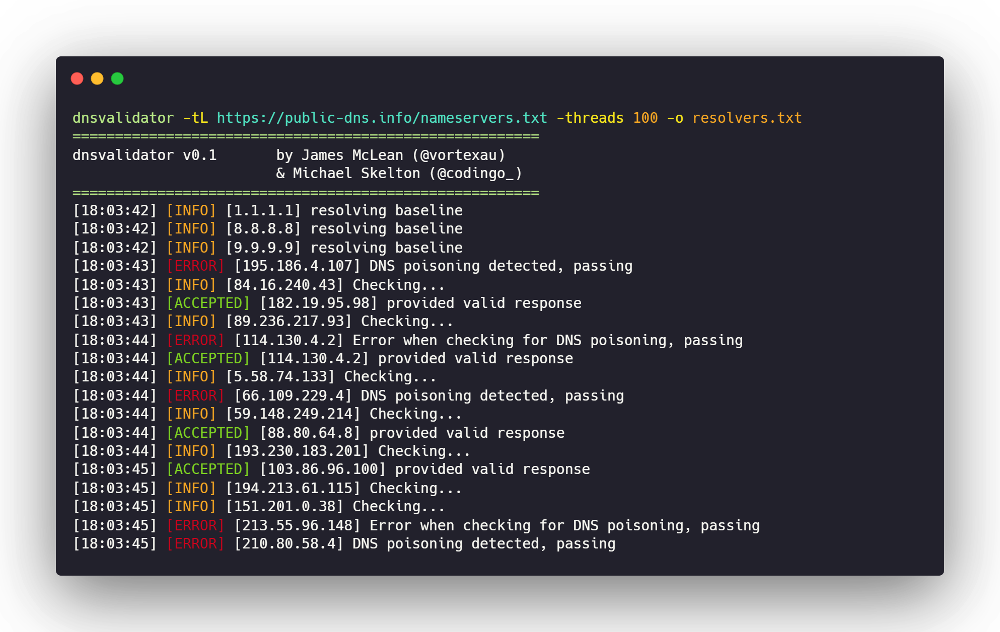
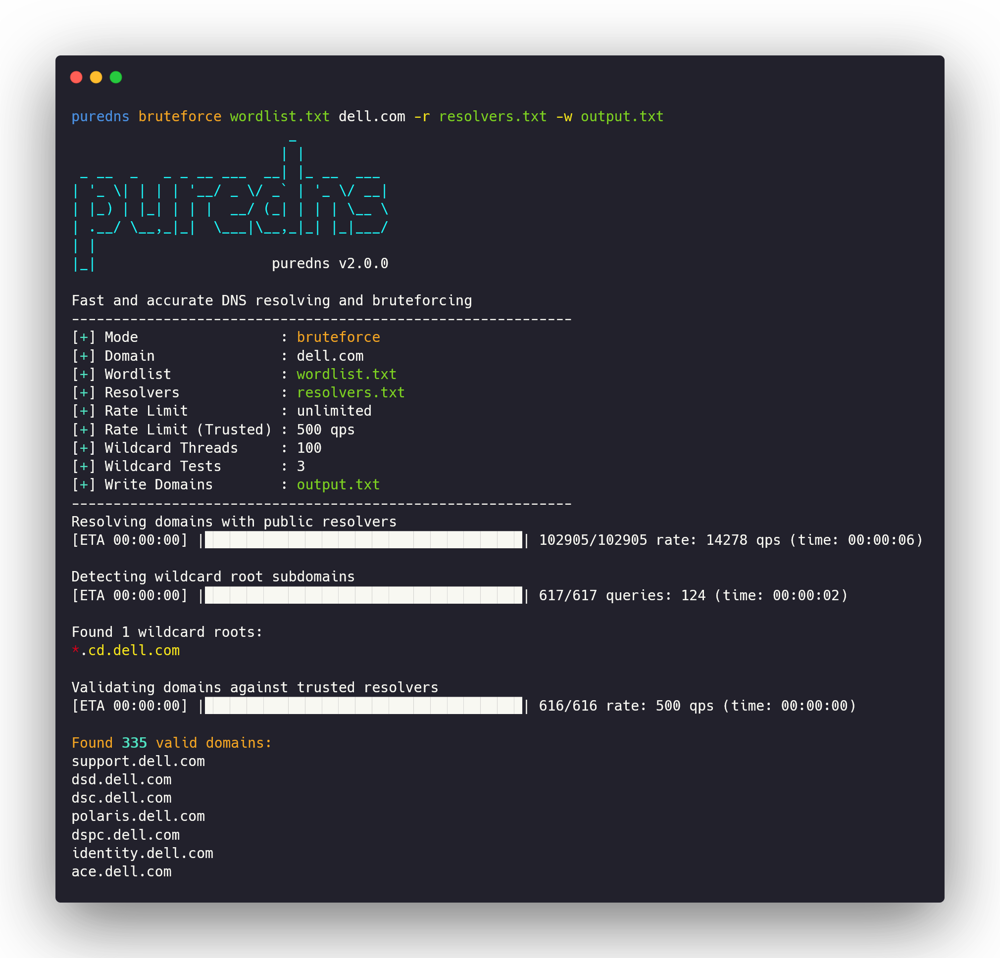

# DNS Bruteforcing

## What is DNS bruteforcing?

In simple terms DNS bruteforcing is a technique where, we prepend a long list of common subdomains names to our target domain and try to DNS resolve this new list in hope to find valid subdomains of our target domain.

This is what happens during DNS bruteforcing:

* **admin**           ---->       **admin**.example.com
* **internal.dev**  ---->      **internal.dev**.example.com
* **secret**           ---->       **secret**.example.com
* **backup01**     ---->       **backup01**.example.com

Now that we have a list of probable domain names that could exists, we can perform DNS resolution on this domain list. This would yield us live subdomains. After this process, if any of these subdomains is found valid, it's a win-win situation for us.

<figure><figcaption></figcaption></figure>

### Why do we perform subdomain bruteforcing?

At times passive DNS data doesn't give all the hosts/subdomains associated with our target. Also, there would some newer subdomains that still wouldn't have been crawled by the internet crawlers. In such a case subdomain bruteforcing proves beneficial.

Earlier DNS zone transfer vulnerabilities were the key to get the whole DNS zone data of a particular organization. But lately, the DNS servers have been secured and zone transfers are found very rarely.


## 🔧Tool:

### Puredns

* **Author:** [d3mondev](https://github.com/d3mondev)
* **Language**: Go
* **Features**: DNS Bruteforcing & Resolution

[**Puredns** ](https://github.com/d3mondev/puredns)outperforms the work of DNS bruteforcing & resolving millions of domains at once. There exists various open-source tools, but puredns is the best in terms of speed & accuracy of the results produced.

### ⚙️How Puredns works:

**1) Sanitize the input wordlist**

The input wordlist is first sanitized to include only valid characters(`[a-z0-9.-]`) and sets each individual line to lowercase.

**2) Mass resolve using the public resolvers**

To perform mass DNS resolution of millions of domains at a high speed puredns uses [**Massdns**](https://github.com/blechschmidt/massdns) as its base tool. Massdns is responsible for validating all the domains in the list against the set of DNS resolvers provided and return only the alive subdomains. This is generally performed at an unlimited rate and generates a huge amount of traffic.

**3) Wildcard detection**

Effective detection of wildcards are key to get accurate results. If wildcards arent detected than the tool outputs a lot of false-positives. But puredns holds good capability over wildcard detection. Hence, it rarely outputs false positives.

**4) Validating results with trusted resolvers**

Once, all the alive subdomains are found, puredns again runs the DNS resolution process over the obtained lists again in order to filter out false-positives. But the catch here is that, this DNS resolution process uses "[**Trusted DNS resolvers**](https://raw.githubusercontent.com/six2dez/resolvers\_reconftw/main/resolvers\_trusted.txt)" inorder to verify the results for the final time. This double resolution process helps in discarding those false-positive results. The main advantage of using Trusted DNS resolvers like Google DNS (`8.8.8.8` , `8.8.4.4`), Cloudflare(`1.1.1.1`) is to avoid DNS poisoned responses or other discrepancies that normal resolvers cause.

### Installing Puredns:

Since this tool is written in Go, your Go environment should be configured properly.

<pre class="language-bash"><code class="lang-bash"><strong>#Prerequisites
</strong>git clone https://github.com/blechschmidt/massdns.git
cd massdns
make
sudo make install

<strong>#Installing the tool
</strong>go install github.com/d3mondev/puredns/v2@latest
</code></pre>

### Running Puredns:

Before we start using puredns for bruteforcing we need to generate our public DNS resolvers list. For this, we will use a tool called [dnsvalidator](https://github.com/vortexau/dnsvalidator). Check [my previous page](https://app.gitbook.com/@sidxparab/s/subdomain-enumeration-guide/introduction/prequisites#2-100-accurate-public-dns-resolvers) to know more about public DNS resolvers and why they are important.

```bash
git clone https://github.com/vortexau/dnsvalidator.git
cd dnsvalidator/
pip3 install -r requirements.txt
pip3  install setuptools==58.2.0
python3 setup.py install
```

**Generating list of open public DNS resolvers**

&#x20;It's very important to note that even if one of your public resolver is failing/not working you have a greater chance of missing an important subdomain. Hence, it's always advised that you generate a fresh public DNS resolvers list before execution.

```bash
dnsvalidator -tL https://public-dns.info/nameservers.txt -threads 100 -o resolvers.txt
```



#### Downloading a pre-populated list of valid DNS resolvers:

Various open source contributors like [proabiral](https://github.com/proabiral/Fresh-Resolvers), [cxosmo](https://github.com/cxosmo/dns-resolvers), [janmasarik ](https://github.com/janmasarik/resolvers)have set up their GitHub-Actions or VPS in order to generate valid public DNS resolvers periodically(every 24hrs). We can make use of these DNS resolvers rather than generating our own resolvers using dnsvalidator which consumes alot of time. To aggregate all of these efforts [Trickest](https://github.com/trickest) have come up with their own repository called [**resolvers**](https://github.com/trickest/resolvers). It is a merged list of all the DNS resolvers, which they validate every 24 hours.

```bash
wget https://raw.githubusercontent.com/trickest/resolvers/main/resolvers.txt
```


Now that we have generated our public DNS resolver we are good to move ahead and perform subdomain bruteforcing using puredns.

```bash
puredns bruteforce wordlist.txt example.com -r resolvers.txt -w output.txt
```

**Flags:**

* **bruteforce** - use the bruteforcing mode
* **r** - Specify your public resolvers
* **w** - Output filename




While performing DNS queries sometimes we receive **SERVFAIL** error. Puredns by default retries on SERVFAIL while most tools don't.


### Which wordlist :page\_facing\_up: to use?

The whole effort of DNS bruteforcing is a waste if you don't use a good subdomain bruteforcing wordlist. Selection of the wordlist is the most important aspect of bruteforcing. Let's have a look at some great wordlists:-\
\
**1) Assetnote** [**best-dns-wordlist.txt**](https://wordlists-cdn.assetnote.io/data/manual/best-dns-wordlist.txt) (**9 Million**) ⭐\
[Assetnote](https://wordlists.assetnote.io/) wordlists are the best. No doubt this is the best subdomain bruteforcing wordlist. But highly recommended that you run this in your VPS. Running on a home system will take hours also the results wouldn't be accurate. This wordlist will definitely give you those hidden subdomains.

**2) n0kovo** [**n0kovo\_subdomains\_huge.txt**](https://github.com/n0kovo/n0kovo\_subdomains/blob/main/n0kovo\_subdomains\_huge.txt) (**3 Million**)\
[N0kovo ](https://github.com/n0kovo)created this wordlist by scanning the whole IPv4 and collecting all the subdomain names from the TLS certificates. You can check out [this blog](https://n0kovo.github.io/posts/subdomain-enumeration-creating-a-highly-efficient-wordlist-by-scanning-the-entire-internet/#benchmarking-) to see how good this bruteforcing wordlist performs as compared other big wordlists. So, if you are target contains a lot of wildcards this would be best wordlist for bruteforcing_(considering the computation bottleneck for wildcard filtering)._

**3) Smaller** [**wordlist**](https://gist.github.com/six2dez/a307a04a222fab5a57466c51e1569acf/raw) (**102k** )\
Created by [six2dez](https://github.com/six2dez) is suitable to be run if you are using your personal computer which is consuming your home wifi router internet.\


### 🙁Problems faced during subdomain bruteforcing

#### &#x20;1) Wildcard filtering

A wildcard DNS record is a record that matches requests for non-existent domain names. Wildcards are denoted by specifying a **`*`** of the left part of a domain name such as **\*.example.com.** That means even if a subdomain doesn't vlid it will return a valid response. See the example below:-

**doesntexists.example.com**    ---->   **valid**&#x20;

**Strange right?** So in short, if a domain is a wildcard domain we will get all valid responses(false positives) while bruteforcing and wouldn't be able to differentiate which are valid and which aren't. To avoid this various wildcard filtering techniques are used by subdomain bruteforcing tools.

**2) Open Public resolvers**

While bruteforcing we tend to use a long wordlist of common subdomain names to get those hidden domains, hence the domains to be resolved will also be large. Such large resolutions cannot be performed by your system's DNS resolver, hence we depend on freely available public resolvers. Also, using public resolvers eliminates the changes of DNS rate limits.

We can get the list of open public DNS resolvers from here [https://public-dns.info/nameservers.txt](https://public-dns.info/nameservers.txt)


:book: Read [**this** ](https://app.gitbook.com/@sidxparab/s/subdomain-enumeration-guide/introduction/prequisites#2-100-accurate-public-dns-resolvers)article on why how to create public resolvers and they are important


**3) Bandwidth**

While performing subdomain bruteforcing [massdns](https://github.com/blechschmidt/massdns) is used as a base tool for DNS querying at very high concurrent rates. For this, the underlying system should also possess a higher bandwidth.&#x20;


## :punch:Issues faced and how to overcome them:&#x20;

#### 1) Crashes on low specs( 1cpu/1gb vps)

Usually, if you provide a very large wordlist(50M) and your target contains significant wildcards then sometimes puredns crashes out due to less memory while filtering wildcards. To overcome this issue you can use **`--wildcard-batch 1000000`** flag. By default, puredns puts all the domains in a single batch to save on the number of DNS queries and execution time. Using this flag takes in a batch of only 1million subdomains at a time for wildcard filtering and after completion of the task takes in the next batch for wildcard filtering.

**2) Puredns kills my home router**&#x20;

Massdns is the one to be blamed for. Massdns tries to perform DNS resolution using public resolvers at an unlimited rate. This generates large traffic and makes your home router unable to use for that specific period of time. To overcome this you can use the **`-l`** flag. This flag throttles the massdns threads to your specified amount. It's advisable that you set the value anywhere between `2000-10000`


