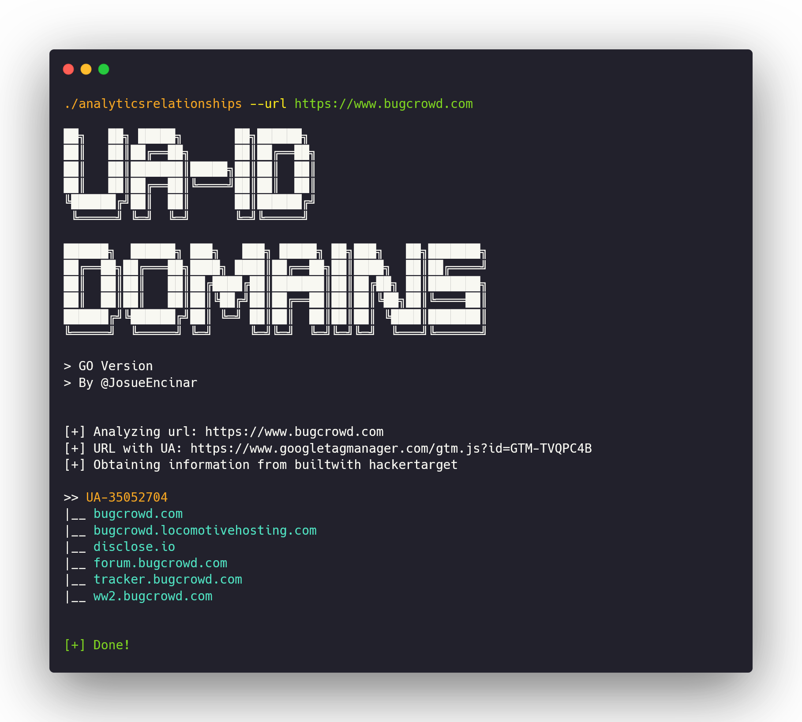

# Google analytics

Most organizations use [Google Analytics](https://analytics.google.com/analytics/web/) to track website visitors and for more statistics. Generally, they have the same Google Analytics ID across all subdomains of a root domain. This means we can perform a reverse search and find all the subdomains having the same ID. Hence, it helps us in the enumeration process.

Most people might be familiar with a browser extension called [**BuiltWidth**](https://builtwith.com/toolbar)**.** But using this extension or its website is a manual process.  We need some sort of command-line utility. That's when **AnalyticsRelationships** comes to the rescue.

## Tool: 

### [AnalyticsRelationships](https://github.com/Josue87/AnalyticsRelationships)

* **Author**: [Josué Encinar](https://github.com/Josue87)
* **Language**: Go/Python

**AnalyticsRelationships** is a tool to enumerate subdomains via Google Analytics ID. It does not require any login and has the capability to bypass the [BuiltWidth ](https://builtwith.com/)& [HackerTarget ](https://hackertarget.com/)captchas. This tool is available in 2 languages Python & Go. But the Go one is faster compared to the python one.

### Installation:

```bash
git clone https://github.com/Josue87/AnalyticsRelationships.git
cd AnalyticsRelationships/GO
go build -ldflags "-s -w"
```

### Running:

```bash
./analyticsrelationships --url https://www.bugcrowd.com
```




