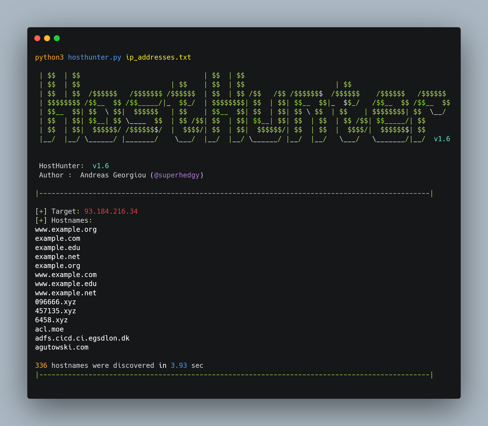

# VHOST probing

## What is Virtual Host?

VHOST(Virtual Host) refers to the practice of running more than one website (such as `company1.example.com` and `company2.example.com`) on a single machine.&#x20;

There are mainly 2 types of Virtual hosts:

1.  **IP-based Virtual Host:**

    In IP-based Virtual Host, we have different IP addresses for every website.
2.  **Name-based Virtual Host:**✔️

    In named-based Virtual Host, several websites are hosted on the same IP. Mostly this type is widely and preferred in order to preserve IP space.

But when talking about VHOST we are generally talking about **Named-based Virtual hosts.**

### How does this actually work?

Now, you would be confused about how will the webserver differentiate to which website it has to send my requests since many websites are being hosted on the same server with the same IP.

It's through the "**Host header**". The web server identifies which content to serve up once it receives the Host header from the client.


### How to identity VHOST on a single IP?

For this purpose, we can use a tool called[ HostHunter](https://github.com/SpiderLabs/HostHunter).

### [HostHunter](https://github.com/SpiderLabs/HostHunter)

* **Author**: [SpiderLabs](https://github.com/SpiderLabs)
* **Language**: Python

#### Installation:

```
git clone https://github.com/SpiderLabs/HostHunter.git
pip3 install -r requirements.txt
```

#### Running:

```
python3 hosthunter.py ip_addresses.txt
```




## VHOST bruteforcing


```
gobuster vhost -u https://example.com -t 50 -w subdomains.txt
```
