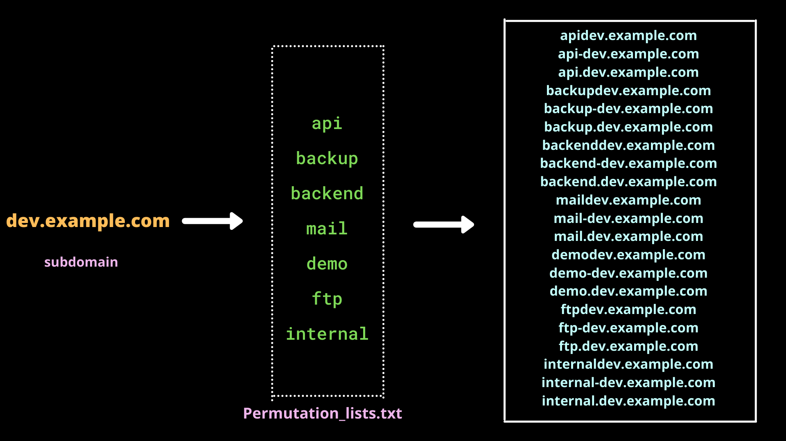
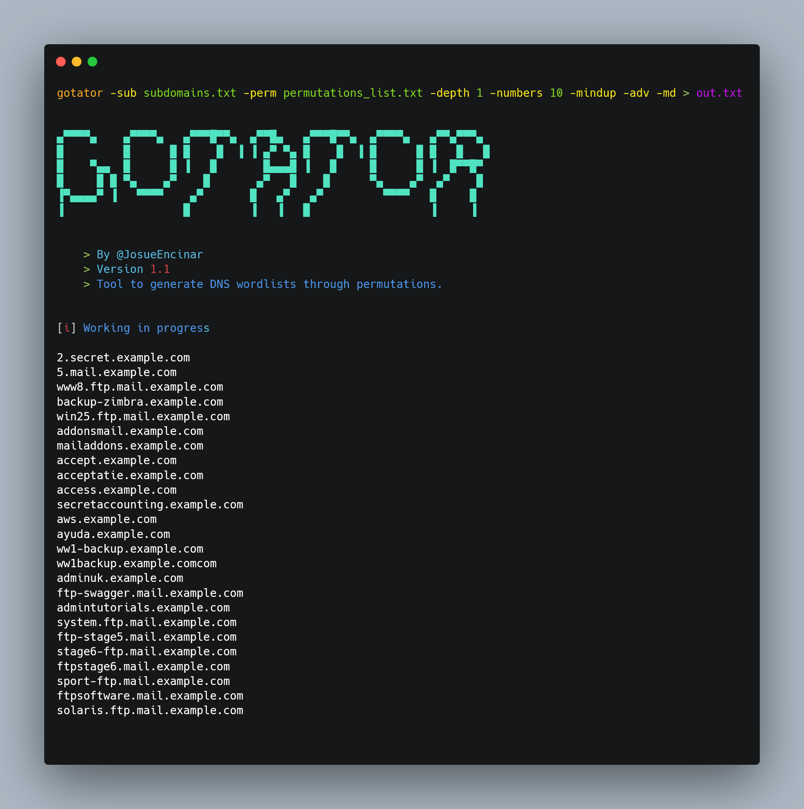

# Permutation/Alterations

It is almost similar to the previous DNS wordlist bruteforcing but instead of simply performing a dictionary attack we generate combinations/permutations of the already known subdomains.

One more thing to be noted here is, we also need a small wordlist with us in this method, which would contain common words like `mail` , `internal`, `dev`, `demo`, `accounts`, `ftp`, `admin`(similar to DNS bruteforcing but smaller)

For instance, let's consider a subdomain **`dev.example.com`** . Now we will generate different variations/permutations of this domain.



Isn't it good that we can generate such great combinations? This is the power of permutation bruteforcing. Now that we have generated these combinations, we further need to DNS resolve them and check if we get any valid subdomains. If so it would be a WIN ! WIN ! 🏁 situation for us.

## Tools:

### [Gotator](https://github.com/Josue87/gotator)

* **Author:** [Josué Encinar](https://github.com/Josue87)
* **Language**: Go

Gotator is DNS wordlist generator tool. It is used to generate various combinations or permutations of a root domain with the user-supplied wordlist. Capable of generating 1M combinations in almost 2 secs.&#x20;

### Features:

* Permute numbers up and down (**dev2** --> `dev0`, `dev1`, `dev2`, `dev3`,`dev4`)
* 3 levels of depth (**`dev`.`demo`.`admin`.**example.com)
* Controls generation of duplicate permutations
* Option to add external permutation list
* Option to permute amongst the subdomains

### Installation:

```bash
go install -v github.com/Josue87/gotator@latest
```

### Running:

* First, we need to make a combined list of all the subdomains(valid/invalid) we collected from all the above steps whose permutations we will create.
* To generate combinations you need to provide a small wordlist that contains common domain names like admin, demo, backup, api, ftp, email, etc.
* [This](https://gist.githubusercontent.com/six2dez/ffc2b14d283e8f8eff6ac83e20a3c4b4/raw) is a good wordlist of 1K permutation words that we will need.
* The below command generates a huge list of non-resolved subdomains.

```
 gotator -sub subdomains.txt -perm permutations_list.txt -depth 1 -numbers 10 -mindup -adv -md > gotator1.txt
```

#### Flags:

* **sub** - Specify subdomain list
* **perm** - Specify permutation/append list
* **depth** - Configure the depth
* **numbers** - Configure the number of iterations to the numbers found in the permutations (up and down)
* **mindup** - Set this flag to minimize duplicates. (For heavy workloads, it is recommended to activate this flag).
* **md** - Extract 'previous' domains and subdomains from subdomains found in the list 'sub'.
* **adv** - Advanced option. Generate permutations words with subdomains and words with -. And joins permutation word in the back



### Resolution:

* Now that we have made a huge list of all the possible subdomains that could exist, now it's time to DNS resolve them and check for valid ones.
* For this, we will again use [Puredns](https://github.com/d3mondev/puredns).
* It's always better to generate fresh public DNS resolvers every time we use them.

```bash
puredns resolve permutations.txt -r resolvers.txt
```

**Flags:**

* **resolve** - Use resolution mode
* **r** - public DNS resolvers list

In such a way, we have got those strange name subdomains and increased our attack surface.

###
