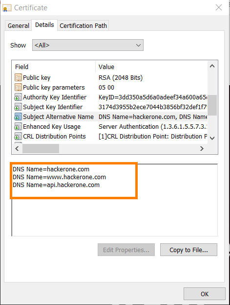
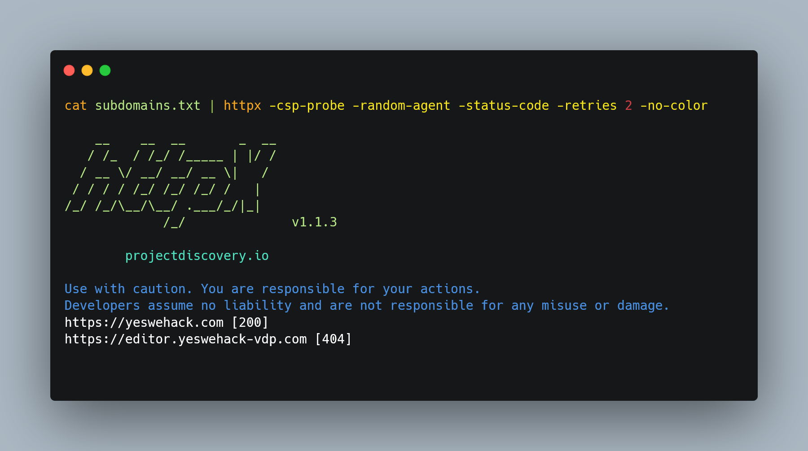

# TLS, CSP, CNAME Probing

## 1) TLS Probing

Nowadays generally all websites communicate over HTTPS(HyperText Transfer Protocol Secure). In order to use HTTPS, the website owner needs to issue an SSL(Secure Socket Layer) certificate.

This SSL/TLS(Transport Layer Security) certificate contains hostname belonging to the same organization.

Clicking on the "Lock🔒" button in the address bar, you can view the TLS/SSL certificate of any website.




For this purpose, we will be using a tool called [**Cero**](https://github.com/glebarez/cero)

#### Installation:

```bash
go install github.com/glebarez/cero@latest
```

#### Running:

```bash
cero in.search.yahoo.com | sed 's/^*.//' | grep -e "\." | sort -u
```

.png)

## 2) CSP Probing

In order to defend from the XSS attacks as well as keeping in mind to allow cross-domain resource sharing in websites CSP(Content Security Policies) are used. These CSP headers sometimes contain domains/subdomains from where the content is usually imported.

Hence, these subdomains can be helpful for us. In the below image we can see I extracted domains/subdomains from the CSP header of [twitter.com](https://twitter.com)

```
cat subdomains.txt | httpx -csp-probe -status-code -retries 2 -no-color | anew csp_probed.txt | cut -d ' ' -f1 | unfurl -u domains | anew -q csp_subdomains.txt
```



## 3) CNAME Probing

I personally came across 2-3 cases where visiting the CNAME of the website showed me the same website without a firewall. (I personally don't know why this happened)

Since then I probe the CNAME's of the subdomains found.

```
dnsx -retry 3 -cname -l subdomains.txt
```
