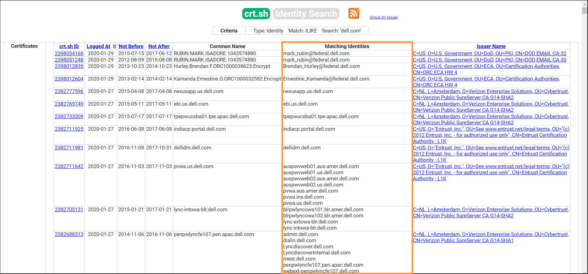

# Certificate Logs

## What are SSL/TLS certificates?

SSL/TLS certificates are obtained to help a website move from "HTTP" to "HTTPS" which is more secure. This certificate is trusted by both the domain presenting the certificates and the clients that use the certificate to encrypt their communications with the domain’s services. To obtain such a certificate we need to request it from the CA(Certificate Authority).


## <mark style="background-color:blue;">1) Certificate Transparency(CT) Logs</mark>

#### What was the need to implement Certificate Transparency Logs?

Before 2013 these CA(Certificate Authority) authorities faced various breaches. Due to such breaches, anyone could maliciously create a forged certificate of the domain owner and gain the trust of the end-user. Also, CA didn't perform proper verifications if the requester is an authorized person of the domain. Hence, there was a need to create a central repository to maintain transparency amongst all.&#x20;

#### What is Certificate Transparency Log?

Google came up with a unique solution to this problem, by introducing [**Certificate Transparency logs**](https://certificate.transparency.dev/). This means that all the certificates issued by the CA would be appended to a common public list. Having a transparent logs of all issued certificates is a great solution for solving the problem of fraudulent certificate issuing, as legitimate domain owners have the ability to spot certificates issued without their consent.

#### How we can abuse CT logs?

Since every time an organization gets an SSL certificate it gets logged in these CT logs, they can be abused easily. As anyone can query them, thus can be utilized to enumerate the subdomains of a root domain that have an accompanying TLS certificate.&#x20;

We can find all SSL certificates belonging to a domain by issuing a GET request to [**https://crt.sh/?q=%25.dell.com**](https://crt.sh/?q=%25.dell.com)



As you can see we got a list of subdomains.

### Tool:  [CTFR](https://github.com/UnaPibaGeek/ctfr)

* **Author**: [UnaPibaGeek](https://github.com/UnaPibaGeek)
* **Language**: Python

[**CTFR** ](https://github.com/UnaPibaGeek/ctfr) is a python based tool that helps to grabs all the subdomains for our target domains using Certificate Transparency(CT) logs. CTFR queries [**crt.sh**](https://crt.sh/) website and retrieves subdomains of our mentioned domain.&#x20;

**Installation:**

```bash
git clone https://github.com/UnaPibaGeek/ctfr.git
cd ctfr/
pip3 install -r requirements.txt
```

**Running CTFR:**

```
python3 ctfr.py -d target.com -o output.txt
```

**Flags:**

* **d** - target
* **o** - output


## <mark style="background-color:blue;">2) tls.bufferover.run</mark>

[**tls.bufferover.run**](https://tls.bufferover.run/) is a service that scans the whole IPv4 address space and grabs all the necessary data from the TLS certificates of those hosts. These TLS certificate include a field called as "**Subject**" that hold necessary information from our perspective. The Subject field contains a component called as "**CommonName(CN)**" which indicates the Fully Qualified Domain Name(FQDN) of that host. So, we can leverage this to look for subdomains of our target. But inorder to query this service we must&#x20;


#### Creating API key:

* Inorder get the results we need to create an API key for this services.
* Visit [https://tls.bufferover.run/](https://tls.bufferover.run/) and enter your email-id for the "Free-Tier" plan.
* You will instantly get the API key in your email Inbox.&#x20;

#### Querying for results:

* Replace the target and API key with yours.

```bash
curl 'https://tls.bufferover.run/dns?q=.dell.com' -H 'x-api-key: TYvnAWCtsmJKTjcYs9bE91aNs8GZZMo5lCX3i06a'| jq -r .Results[] | cut -d ',' -f5 | grep -F ".dell.com" | sort -u output.txt
```

