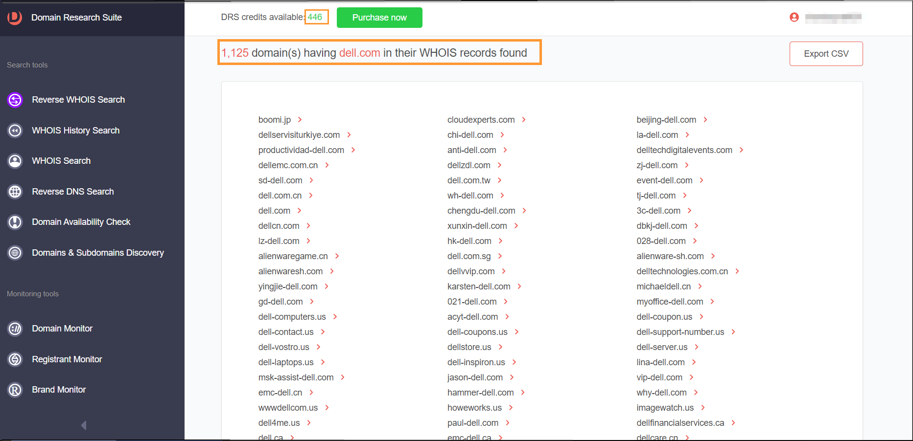
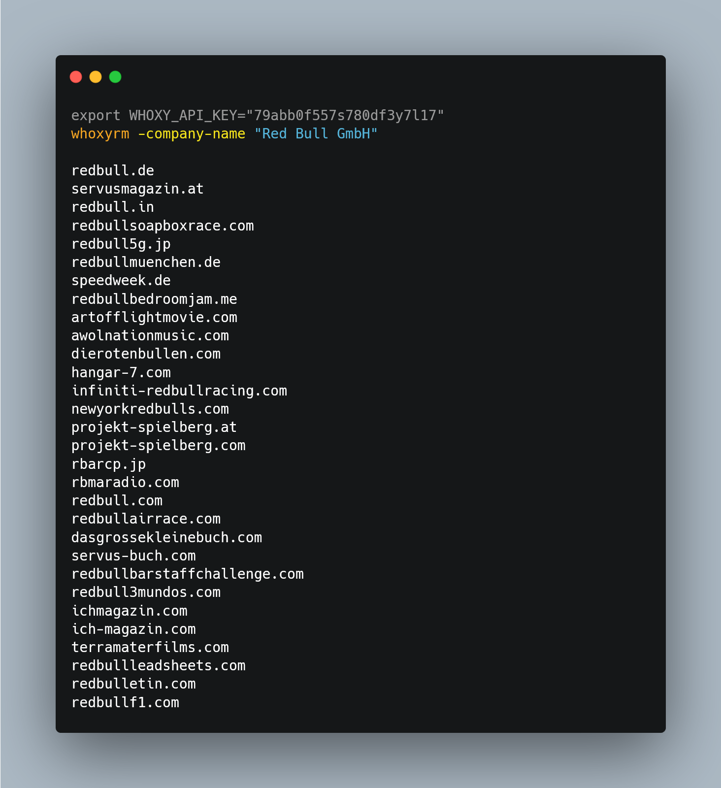
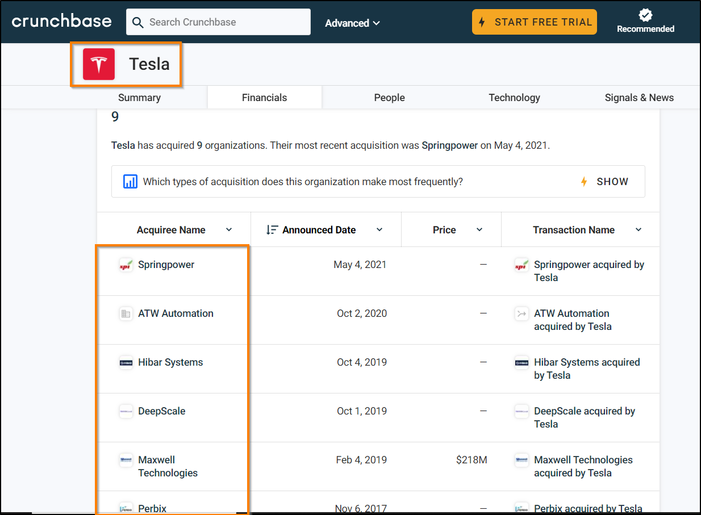
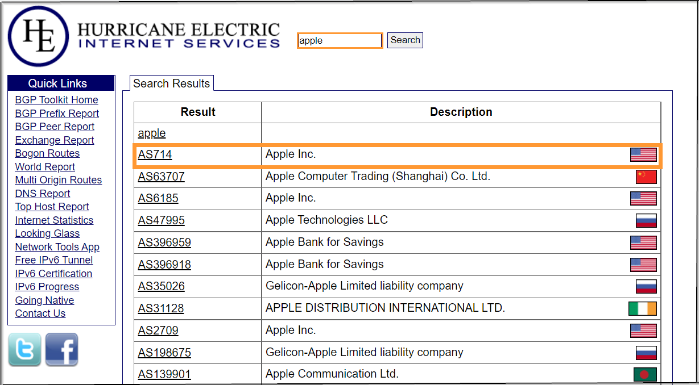
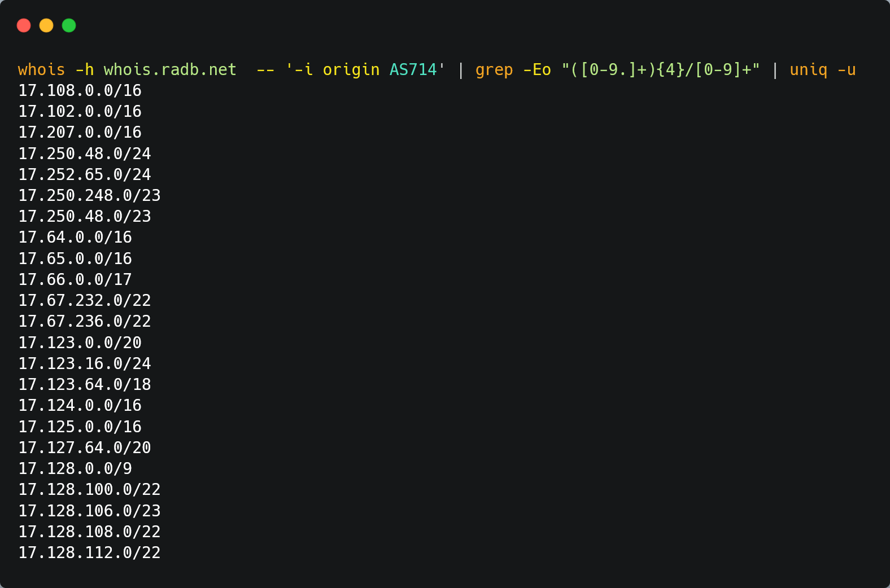
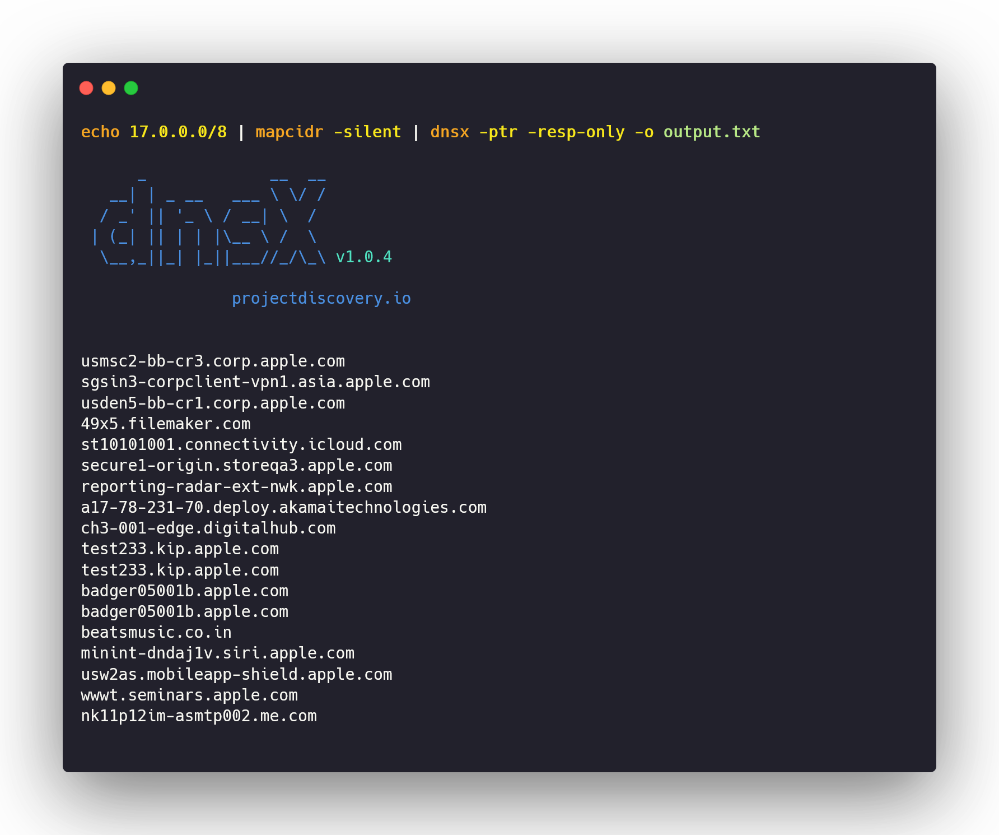
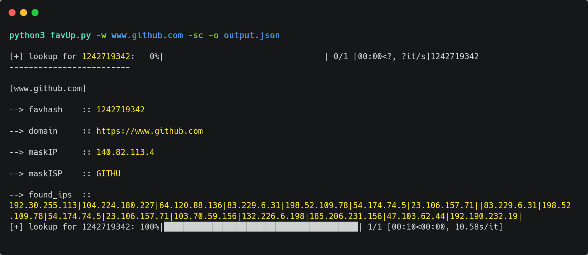

# Horizontal Enumeration

While performing a security assessment our main goal is to map out all the root domains owned by a single entity. This means, making an inventory of all the internet facing assets of a particular organization. It is a bit trickier to find related domains/acquisitions of a particular organization as this step includes some tedious methods and doesn't guarantee accurate results always. One has to solely perform manual analysis to verify the results.

From the below image you can get an idea of what a **horizontal domain correlation** is:

.png>)

\
Let's look at how to find these related horizontal domains.


These enumeration methods can go out of scope and backfire you. Do it with caution!


## <mark style="background-color:orange;">1) Finding related domains/acquisitions</mark>

#### a) **WhoisXMLAPI**

[**WhoisXMLAPI** ](https://www.whoisxmlapi.com/)is an excellent source that provides a good amount of related domains & acquisitions based on the WHOIS record. Singing up on their platform will assign you **500 free credits** which renews every month.\
Visit [https://tools.whoisxmlapi.com/reverse-whois-search](https://tools.whoisxmlapi.com/reverse-whois-search) . Searching with the root domain name like **dell.com** will give you a list of all the associated domains.




These are not 100% accurate results, as they contain false positives &#x20;


#### b) **Whoxy** :moneybag:&#x20;

[**Whoxy**](https://www.whoxy.com/) is yet another great source to perform reverse WHOIS on parameters like Company Name, Registrant Email address, Owner Name, Domain keyword. Whoxy has an enormous database of around **455M WHOIS records**. But sadly this is a paid service :(

To effectively use Whoxy API there's a command-line tool called [**whoxyrm**](https://github.com/MilindPurswani/whoxyrm)**.**

```
go get -u github.com/milindpurswani/whoxyrm
export WHOXY_API_KEY="89acb0f4557df3237l1"

whoxyrm -company-name "Red Bull GmBH"
```



#### c) Crunchbase:moneybag:&#x20;

[**Crunchbase**](https://www.crunchbase.com/) is another great alternative for finding acquisitions but requires a paid subscription to view all the acquisitions. The trial version allows viewing some of the acquisitions.

<figure><figcaption></figcaption></figure>

#### d) ChatGPT

You can leverage OpenAI's [**ChatGPT**](https://chat.openai.com/) for getting a list of acquisitions that are owned by a particular organization. Below is the example of getting acquisitions of Tesla.&#x20;

<figure><figcaption></figcaption></figure>

##

## <mark style="background-color:orange;">2) Discovering the IP space</mark>

**ASN**(Autonomous System Number) is a unique identifier for a set of IP-ranges an organizations owns. Very large organizations such as Apple, GitHub, Tesla have their own significant IP space. To find an ASN of a particular organization, [https://bgp.he.net](https://bgp.he.net/) is a useful website where we can query.\
Let's find ASN for **Apple Inc.**



Now that we have found out the ASN number of an organization, the next step is to find out the IP ranges that reside inside that ASN. For this, we will use a tool called **whois.**

<pre class="language-bash"><code class="lang-bash">apt-get install whois
<strong>whois -h whois.radb.net  -- '-i origin AS714' | grep -Eo "([0-9.]+){4}/[0-9]+" | uniq -u
</strong></code></pre>

<figure><figcaption></figcaption></figure>


## <mark style="background-color:orange;">3) PTR records (Reverse DNS)</mark>

Now since we have got to know the IP address ranges from ASN of an organization, we can perform reverse DNS(PTR) queries on the IP addresses and check for valid hosts.\
\
**What is reverse DNS?**\
When a user attempts to open a domain/website in their browser, a DNS lookup occurs. This maps out the IP address(192.168.0.1) of the associated domain name(example.com). A reverse DNS lookup is the opposite of this process; it is a query that starts with the IP address and looks up the associated domain name of it.

This means that, since we already know the IP space of an organization we can, we can reverse query the IP addresses and find the valid domains. Sounds cool?

**But how?**\
DNS PTR records (pointer record) helps us to achieve this. Using [**dnsx**](https://github.com/projectdiscovery/dnsx) tool we can query a PTR record of an IP address and find the associated hostname/domain name.

**Apple Inc.** :apple:  owns **ASN714** which represents IP range **17.0.0.0/8.** So now, lets perform reverse DNS queries to find out the domain name&#x73;**.**

### Running:

We will first need to install 2 tools:

*   [**Mapcidr**](https://github.com/projectdiscovery/mapcidr)  :

    ```
    go install -v github.com/projectdiscovery/mapcidr/cmd/mapcidr@latest
    ```
*   [**Dnsx** ](https://github.com/projectdiscovery/dnsx):

    ```
    go install -v github.com/projectdiscovery/dnsx/cmd/dnsx@latest
    ```

**One liner:**

```bash
echo 17.0.0.0/16 | mapcidr -silent | dnsx -ptr -resp-only -o output.txt
```

#### Breakdown:

* When an IP range is given to **mapcidr** through stdin(standard input), it performs expansion of the CIDR range, spitting out each IP address from the range onto a new line.
* Now when **dnsx** receives each IP address from stdin, it performs reverse DNS and checks for PTR record. If, found it gives us back the hostname/domain name.



##

## <mark style="background-color:orange;">4) Favicon Search</mark>

#### What is a favicon?

The image/icon shown on the left-hand side of a tab is called as **favicon.ico**. This icon is usually a picture that can be hosted on a different endpoint, host or CDN. We can check whether the URL for the favicon is present in the Web page source code or not.&#x20;

<figure><figcaption></figcaption></figure>

#### How to find the favicon.ico link?

* Visit any website which already posses a favicon ([https://github.com/](https://github.com/))
* Now, view the source code and find the keyword "**favicon**" in the source code.
* You will find the link where the favicon is hosted ([https://github.githubassets.com/favicons/favicon.png](https://github.githubassets.com/favicons/favicon.png))

#### How can we leverage this to find different root domains?

* Usually the web assets owned by a particular company will have the same logo/favicon image across various domains.&#x20;
* Hence, we can make a Internet wide search using Shodan to get all the domains/IP addresses of such web assets that have a common favicon.

### [Fav-UP](https://github.com/pielco11/fav-up):&#x20;

* **Author**: [Francesco Poldi](https://github.com/pielco11)
* **Language**: Python

Fav-Up is a great tool that can help us in the process to automate the steps of performing a favicon hash search. The FavUp.py is python based tool that performs execution in the following steps:&#x20;

1. First will visit the page source of the mentioned website and try to find the URL on which the favicon is hosted.
2. After fetching the favicon.ico, now the tool generates [**MurmurHash** ](https://en.wikipedia.org/wiki/MurmurHash)of that favicon which is unique to every favicon.
3. Now it performs a **Shodan** search to find all the IP addresses that have the same favicon in their title(`http.favicon.hash:<hash>`)

<pre><code><strong>#Installation
</strong>git clone https://github.com/pielco11/fav-up.git
cd fav-up/
pip3 install -r requirements.txt
apt-get install jq

<strong>#Initializing Shodan API key
</strong>shodan init A5TCTEH78E6Zhjdva6X2fls6Oob9F2hL

<strong>#Running the tool
</strong>python3 favUp.py -w www.github.com -sc -o output.json

<strong>#Parsing the output
</strong>cat output.json | jq -r 'try .found_ips' | sed "s/|/\n/g"

</code></pre>

<figure><figcaption></figcaption></figure>

**You know this is a powerful technique when the Recon king**:crown: **tweets about it.**


\
\


## &#x20;:checkered\_flag:**That's it !!! Done with Horizontal Enumeration**:checkered\_flag:&#x20;

#### Liked my work? Don't hesitate to buy me a coffee XDD

#### :heart::blue\_heart::green\_heart: [https://www.buymeacoffee.com/siddheshparab](https://www.buymeacoffee.com/siddheshparab) :green\_heart: :blue\_heart: :heart:&#x20;


