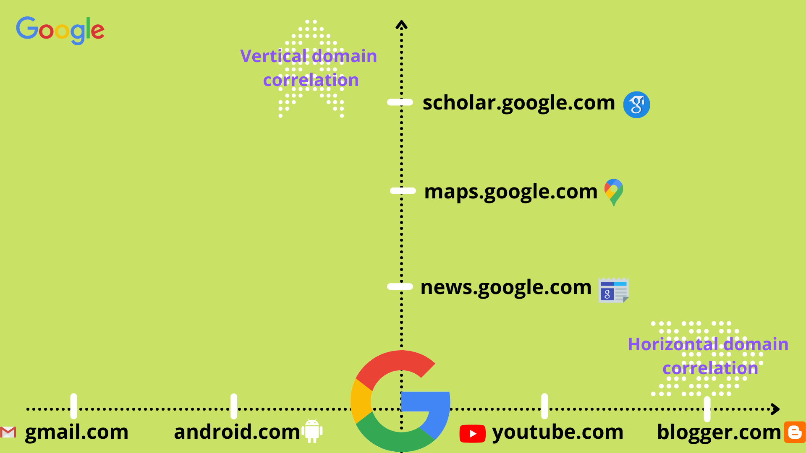

# Vertical Enumeration

Vertical Enumeration or Vertical domain correlation is a process of finding out domains of the same root domain. This type of enumeration contains various techniques and can be automated too.

Here, we find different levels of subdomains of a particular root/main domain.

This includes various intensive techniques which we will see further in this guide.

1. **Passive Techniques**
   * Passive Sources&#x20;
   * Certificates Logs
2. **Active Techniques**
   * DNS bruteforcing
   * Permutations
   * JS/Source Code Scraping
   * VHOST discovery
   * Google Analytics
   * Recursive Enumeration
   * Favicon Hashing
   * TLS, CSP, CNAME probing
3. **Web probing**
   * Default Ports
   * Common Ports

Each and every technique is explained in detail, so read out the whole guide. :blush:&#x20;
