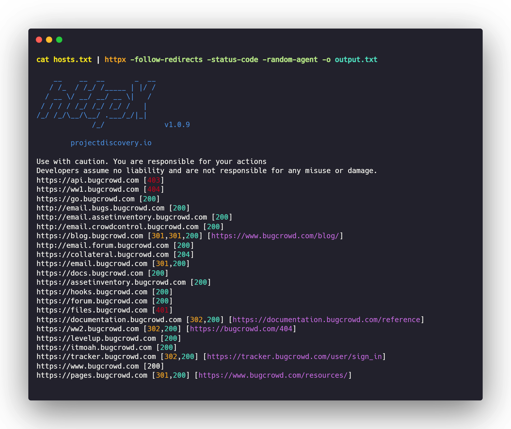

# Web probing

Another important aspect of subdomain enumeration is identifying web applications hosted on those subdomains. Most people perform pentesting on web applications only hence their accurate identification/discovery is essential.

Port **80 & 443** are the default ports on which web applications are hosted. But one must also check for web applications on other common web ports. Most times something hosted on other common ports is very juicy or paid less attention by organizations.

## Tools

### [HTTPX](https://github.com/projectdiscovery/httpx)

* Author: [projectdiscovery](https://github.com/projectdiscovery)
* Language: Go

**Httpx** is a fast multi-purpose toolkit that allows running multiple HTTP probers and find for web applications on a particular port. (find hosts ?)\
Httpx is a highly configurable tool, which means it provides a ton of flags. So, users can get a highly customizable output as per their needs.

### Installation:

```bash
GO111MODULE=on go get -v github.com/projectdiscovery/httpx/cmd/httpx
```

### Running Httpx

```bash
cat hosts.txt | httpx -follow-redirects -status-code -random-agent -o output.txt
```

### Flags:

* **follow-redirects -** Follows redirects (can go out-of-scope)
* **follow-host-redirects -** Follows redirects if on the same host (helps to be in-scope)
* **random-agent -** Uses a random user-agent for each request
* **status-code -** Shows the status code
* **retries** - Number of times to retry if response not received
* **no-color** - Don't use colorized output (to avoid color Unicode issues in output file)
* **o** - Output file



## Probing on default ports:

By default, [**httpx** ](https://github.com/projectdiscovery/httpx)will probes on port **80**(HTTP) & **443**(HTTPS). Organizations host their web applications on these ports. After subdomain enumeration, the next first task is identifying web applications where vulnerabilities are found in abundance.

```bash
cat subdomains.txt | httpx -random-agent -retries 2 -no-color -o output.txt
```

## Probing on common ports:

Most people check for web applications only on the default ports, but what they fail to check is whether an application is hosted on any other port?

Generally, there are around **88 common ports** on which web applications may be hosted. So, it's our duty to check for them. 👉 [**Here**](https://gist.github.com/sidxparab/459fa5e733b5fd3dd6c3aac05008c21c)👈 is the list of those common ports. Mostly anything hosted on these ports is very juicy and tends to yield a higher vulnerability.

### Method:

### 1) Using [httpx](https://github.com/projectdiscovery/httpx)

```bash
cat subdomains.txt | httpx -random-agent -retries 2 -threads 150 -no-color -ports 81,300,591,593,832,981,1010,1311,1099,2082,2095,2096,2480,3000,3128,3333,4243,4567,4711,4712,4993,5000,5104,5108,5280,5281,5601,5800,6543,7000,7001,7396,7474,8000,8001,8008,8014,8042,8060,8069,8080,8081,8083,8088,8090,8091,8095,8118,8123,8172,8181,8222,8243,8280,8281,8333,8337,8443,8500,8834,8880,8888,8983,9000,9001,9043,9060,9080,9090,9091,9200,9443,9502,9800,9981,10000,10250,11371,12443,15672,16080,17778,18091,18092,20720,32000,55440,55672 -o output.txt         
```

* Using **httpx** for common ports generally takes a lot of time as it needs to probe on a relatively higher amount of ports(88 in total). Hence, this method is feasible.

### 2) Using [Unimap](https://github.com/Edu4rdSHL/unimap)

**Unimap** is a port scanner that uses [**Nmap**](https://github.com/nmap/nmap) as its base. Using Unimap we quickly scan for whether any of those 88 common ports are open on the subdomain or not(this happens at a blazing fast speed). Once we know that a particular port is open on the subdomain we can later send HTTP probes using **httpx** and check whether a web application is available on that open port or not\*\*.\*\* This method is far more quicker than just using httpx.

**What's so special about Unimap?**

* You would be wondering why didn't we use Nmap/Naabu for port scanning purposes right?
* The answer lies in the way Unimap performs open port scanning.
* Sometimes many subdomains point to the same IP address. Hence, scanning the same IP again & again would lead us to an IP ban or greater execution time.
* Unimap uses its own technology to initially resolve the IP addresses of all subdomains, once this process is finished, it creates a vector with the unique IP addresses and launches a parallel scan with Nmap.

### Installation:

```bash
wget -N -c https://github.com/Edu4rdSHL/unimap/releases/download/0.5.1/unimap-linux
sudo mv unimap-linux /usr/local/bin/unimap
chmod 755 /usr/local/bin/unimap
strip -s /usr/local/bin/unimap
```

### Steps:

**1)** First let's initialize all the common ports into a variable called `COMMON_PORTS_WEB`

```bash
COMMON_PORTS_WEB="81,300,591,593,832,981,1010,1311,1099,2082,2095,2096,2480,3000,3128,3333,4243,4567,4711,4712,4993,5000,5104,5108,5280,5281,5601,5800,6543,7000,7001,7396,7474,8000,8001,8008,8014,8042,8060,8069,8080,8081,8083,8088,8090,8091,8095,8118,8123,8172,8181,8222,8243,8280,8281,8333,8337,8443,8500,8834,8880,8888,8983,9000,9001,9043,9060,9080,9090,9091,9200,9443,9502,9800,9981,10000,10250,11371,12443,15672,16080,17778,18091,18092,20720,32000,55440,55672"
```

**2)** Now we will run a port scan to check all the open ports

```bash
sudo unimap --fast-scan -f subdomains.txt --ports $COMMON_PORTS_WEB -q -k --url-output > unimap_commonweb.txt
```

**3)** Now that we have a list of open ports, we will check for web applications running on them using **httpx**.

```bash
cat unimap_commonweb.txt | httpx -random-agent -status-code -silent -retries 2 -no-color | cut -d ' ' -f1 | tee probed_common_ports.txt
```

* That's it, we have got those hidden web applications running on common ports. Go ahead! and hunt on them. 🐞

\*\*\*\*📊 **Some stats:** 🤓

| **Method** | **Execution Time (150 subdomains)** |
| ---------- | ----------------------------------- |
| 1st Method | 42min 51secs                        |
| 2nd Method | **55 secs** ⚡                       |
